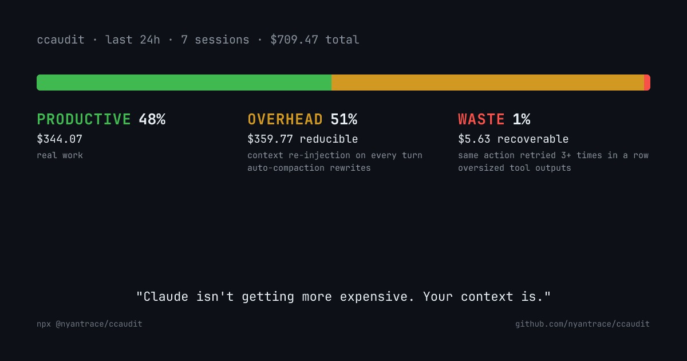

# ccaudit

Find where your Claude Code tokens went. Local, offline.

```bash
npx @nyantrace/ccaudit
```

```
ccaudit — last 7 days · 18 sessions across 3 projects

Total: $142.30 (156.2M tokens)
├─ Productive: $71.15 (50%)
├─ Overhead:   $70.25 (49%)  reducible with config changes
└─ Waste:       $0.90  (1%)  recoverable with config changes

Where your tokens went:
  1. [ohead] Context re-injection on every turn       $62.40
        1240 turns re-read cached context (CLAUDE.md, history, system prompt)
        → Trim CLAUDE.md, move reminders to frequency: session_start
  2. [ohead] Auto-compaction rewrites                   $7.85
        9 compactions rewrote 1250K tokens to cache
        → Trim CLAUDE.md, reduce context footprint
  3. [waste] Same action retried 3+ times in a row      $0.52
        15 clusters (3 consecutive failing tool calls on same input)
        → Fix root cause. Repetition does not recover a failing tool.

Top fix: Trim CLAUDE.md, move reminders to frequency: session_start
```

## What ccaudit attributes

Seven heuristics split your spend into three buckets.

**Productive** is the agent doing real work. **Overhead** covers cached context re-injected on every turn and auto-compaction, reducible with a leaner CLAUDE.md. **Waste** is what you can recover with config changes, such as duplicate reads, retry loops, or frustration cycles.

The heuristics:

- Context re-injection every turn (CLAUDE.md and cached history)
- Auto-compaction rewrites
- Same file read more than twice
- Three consecutive failing tool calls on the same input
- Correction cycles (short "no, not that" user messages)
- Oversized tool outputs that bloat subsequent cache-writes
- Subagent / sidechain blowup

## Install

Run with npx, or install globally.

```bash
npx @nyantrace/ccaudit
# or
npm i -g @nyantrace/ccaudit
ccaudit
```

## Usage

```bash
ccaudit                        # last 7 days, all projects
ccaudit --since 30d            # custom window
ccaudit --project nyantrace    # filter by project slug
ccaudit --share                # 1200x630 PNG for X / HN
ccaudit --share --out card.png # custom output path
ccaudit --json                 # structured output
```

## Shareable card

`ccaudit --share` writes a 1200x630 PNG. Three-bucket bar, top examples per bucket, a tagline that changes with your data. No watermarks. Drop it into X or Hacker News.



## How it works

The CLI reads session JSONL at `~/.claude/projects/*/*.jsonl` from your own disk. For each turn it parses `message.usage`, groups by session and project, runs seven heuristics, and prices against current Claude model rates.

Data stays local. No account, no telemetry, no server.

## Limitations

Pricing is hardcoded to April 2026 Anthropic rates for Opus 4.5+, Opus 4.1 and earlier (legacy), all Sonnets, Haiku 4.5, Haiku 3.5, and Haiku 3. 5-minute and 1-hour cache writes are priced separately. Unknown model strings fall back to Sonnet. Because cache-read tokens do not carry per-file tags in the session format, a few heuristics approximate. Sidechain attribution assumes `isSidechain: true` events are subagent turns. Opus 4.7 uses a new tokenizer that may show higher raw token counts than earlier Opus models for the same text. If Claude Code changes its JSONL format, open an issue.

## Who made this

Built by the [Nyantrace](https://nyantrace.com) team.

## License

MIT
